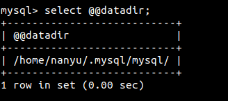

#### Linux MySQL database migrate

The program is aim at migrate MySQL database to a new destination( instead of */var/mysql/mysql*) at Linux environment. 

##### Example

```python
sudo python3 MySQL_migrate.py destination_place
```

Here I replace **destination_place** with */home/nanyu/.mysql*. 


Then after finish, the new data folder will like below:



Any problems please email me at: *zheng.nan.yu@qq.com*


